# 海南环岛十日攻略

待解决的问题：

- 运输问题：车辆如何运输
- 路线问题：有环岛，有半环岛
- 岛上攻略：该去的一些地方，该尝试的一些东西
- 时间安排
- 意外安排：如台风、雨天等影响

## 骑行前准备

- 手机、身份证、纸币若干
- 换洗速干衣裤、雨衣、鞋子
- 头盔
- 备胎x2、修理工具

出去骑行的话，不要带太多的东西，累！

下面的这款包不错(不是打广告哈)，容量大，方便拆卸，最主要的是不需要你加装副条。

### 车辆运输

- **本地寄车** - 一般专卖店都有寄车服务，这个根据不同地点寄送的时间有所不同，**需要提前预估时间**，以免到时候人到了，车没到，就尴尬了。海口有很多加盟的骑行客栈，里面都有接车的服务，可以发到客栈中，到时候再装。
- **飞机火车托运** - 车跟着人。
- **租车** - 客栈也提供租车服务。具体的可以提前打电话咨询。

以下内容绝对不是广告！！！

`特别提醒：国庆是旅游旺季，任何操作都需要提前预约！否则，黑嘿嘿。`

## 线路推荐

(详细的内容可以参考最下面的链接)

### 东线

海口 -> 文昌(清澜镇) -> 博鳌 -> 神州半岛 -> 三亚

[路书点这里](https://www.imxingzhe.com/lushu/877625/)

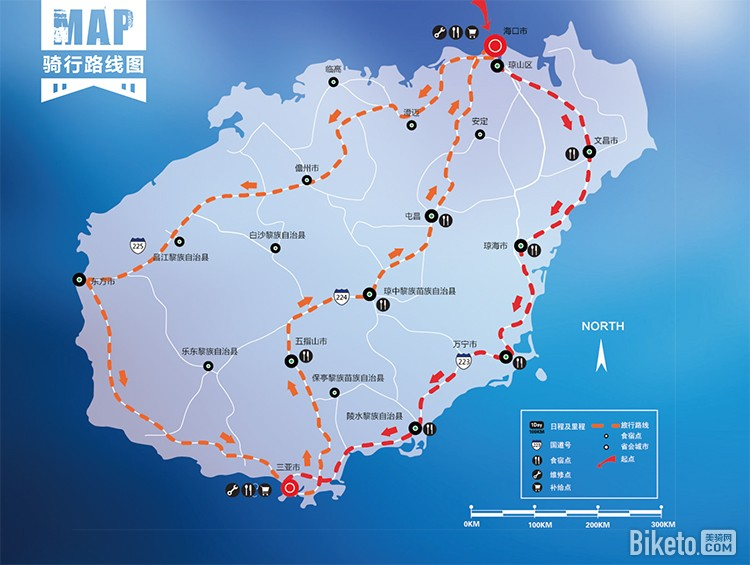

#### Day1 海口 -> 文昌

距离：大约100km。

推荐景点：

- [东郊椰林](https://www.amap.com/search?id=B07650045V&city=469005&geoobj=110.321762%7C18.920998%7C111.194578%7C19.331596&query_type=IDQ&query=%E4%B8%9C%E9%83%8A%E6%A4%B0%E6%9E%97%E9%A3%8E%E6%99%AF%E5%8C%BA&zoom=11.18)
- [航天渔人码头](https://www.amap.com/place/B0FFIFHEJ9)

体验：

- 实际上到达的地点在 **龙楼**，可以选择 **140km** 的路线，去看看海南最北角的灯塔。不想走那么远的，可以选择 **90km** 的路线。
- 龙楼最赞的要属日落了，在 **石头公园**，这时候(2019年 10月 09日)太阳一般下山时间为 **6：30**。

- **石头公园** 是一处海湾，不过不是沙滩，全是石头，可以去看看。

- 一路上有很多海南特色的东西，骑慢点，好好体会。

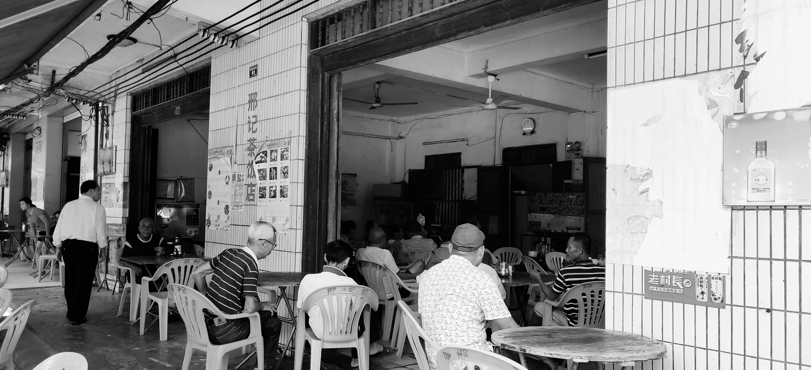

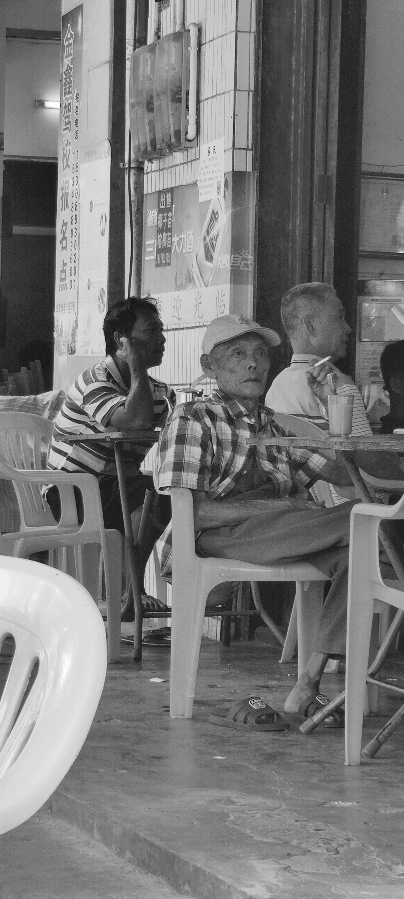

#### Day2 文昌 -> 博鳌

距离：大约80km。

推荐景点：
  
- [博鳌海滨酒吧公园](https://www.amap.com/place/B0FFG7M5V1)
- [博鳌玉带滩](https://www.amap.com/place/B07660LPTT)
- [博鳌亚洲论坛永久会址](https://www.amap.com/place/B0766003XK) - 需要门票

体验：

- 博鳌镇沿着玉带滩一带都有酒吧，晚上去会很有氛围。

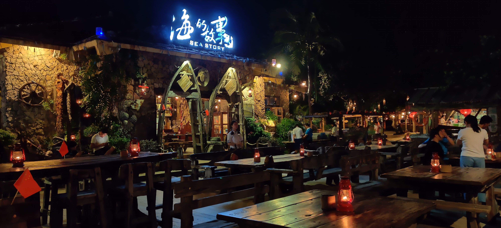

- 早上可以起早点去看日出，第一次看海上日出，还是被震撼到了。不太喜欢人多的地方，好在住的地方在驿站，走个500米就到了海边。

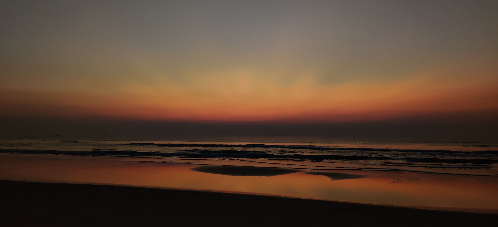

- **清补凉**，在博鳌吃的一份清补凉，味道挺正，至今难忘。那家店蛮大的，在街上可以看到。

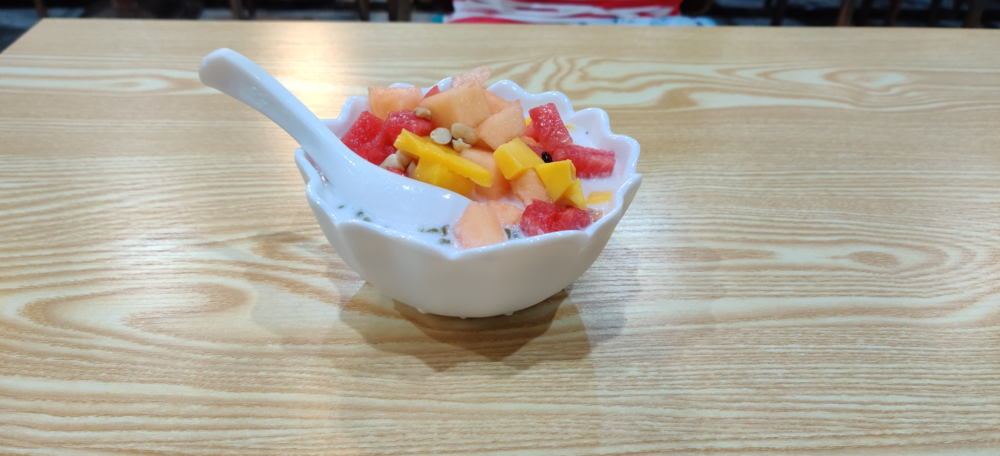

#### Day3 博鳌 -> 神州半岛

距离：大约90km。

路线：

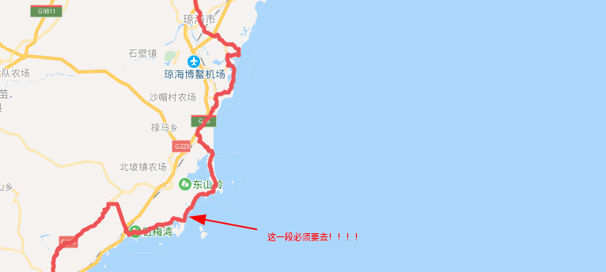

推荐景点：

- [万宁市滨海旅游公路](https://www.google.com/search?q=%E4%B8%87%E5%AE%81%E5%B8%82%E6%BB%A8%E6%B5%B7%E6%97%85%E6%B8%B8%E5%85%AC%E8%B7%AF&oq=%E4%B8%87%E5%AE%81&aqs=chrome.1.69i57j35i39j0l4.8538j0j1&sourceid=chrome&ie=UTF-8)
- [石梅湾](https://www.amap.com/place/B076A00310)
- [蜈支洲岛](https://www.amap.com/place/B0FFFUBJXQ)

体验：

- 早上从博鳌出发，中午到了一个小镇，吃了碗炒面，和老板交谈，了解了一些网上没有的东西。
- 有个叫做 **大花角** 的地方，骑行路上可以经过。
- 老板推荐的路线是，从 **港北港** 坐船，沿着海岸线，一直划到大花角，沿途岸边的石头各异，十分好看。租船费用大约200-300RMB。

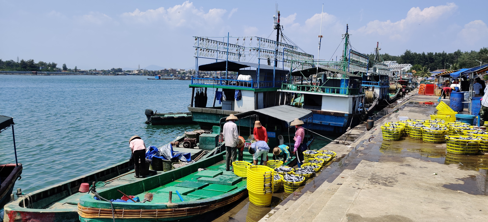

(港北港上的码头)

- **万宁市滨海旅游公路**，过了大花角，根据驿站老板的口述，上了这条旅游公路。一路上并没有沙滩，沙滩和你之间隔了一个灌木从...累了，可以到海边吹吹海风。

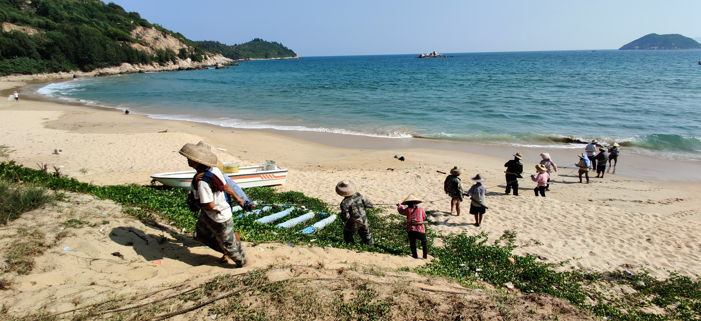

- **石梅湾**，听说有最美的海滩，可能不太对我的胃口，不太喜欢人多的地方。

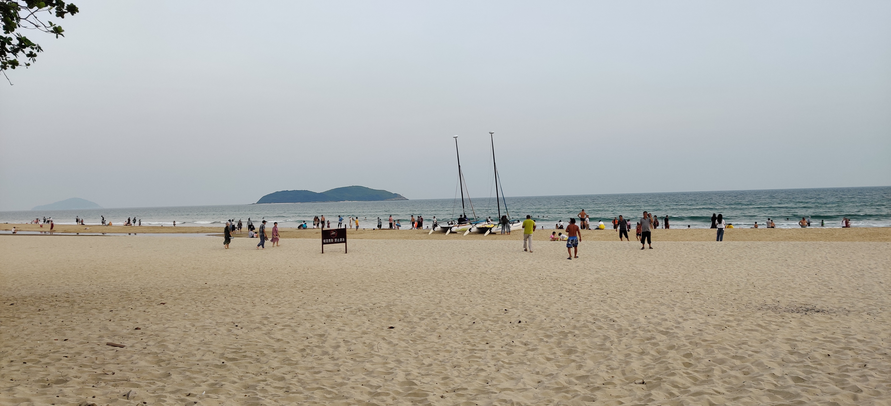

- **吃饭**，一路上快到神州半岛的地方会有一排的海鲜饭店，不太贵，味道也不错。(往西线走的话，莹歌海可以自己向渔民买，白灼一下虾就很好吃了)

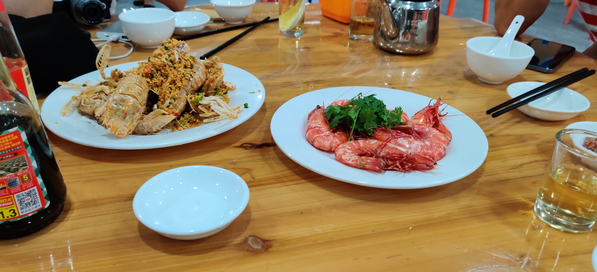

#### Day4 神州半岛 -> 海棠湾

距离：100km

推荐景点：

- [海棠湾](https://www.amap.com/place/B0FFFDRZ5V)
- [蜈支洲岛](https://www.amap.com/place/B0FFFUBJXQ)

体验：

- 一路上是海南特有的乡村风情，牛很多，槟榔随便摘。
- 芒果很多，快到三亚的路上，一路上全是芒果批发，这个季节的芒果正好，适合硬硬的时候吃。想买一点当特产的可以考虑一下。

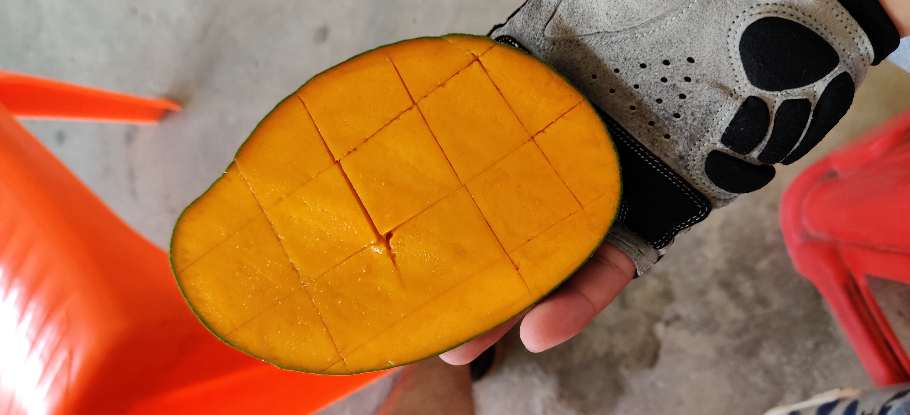

- 到了海棠湾，没去三亚市。海棠湾在 **蜈支洲岛** 附近。海棠湾住宿的地方很多，都是民宿。酒吧也多，靠近海湾一边基本上都是。以前的小渔村变的太快了。

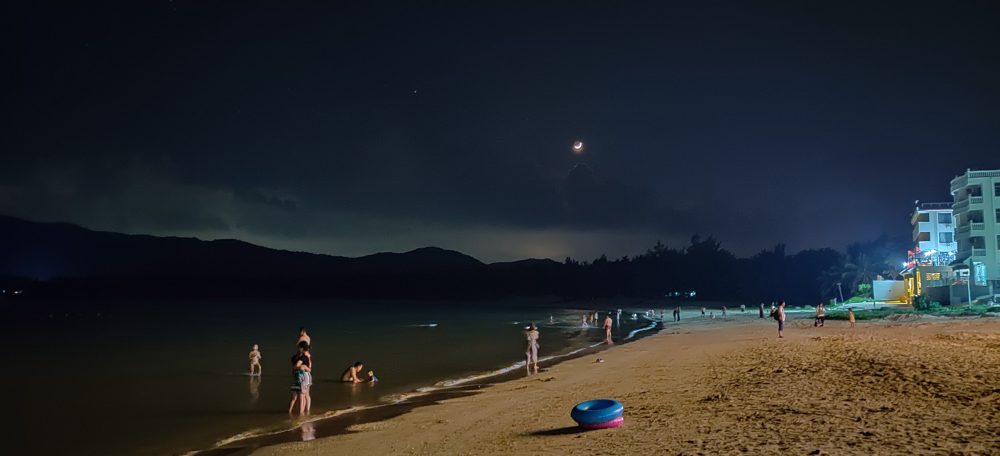

- 周边可以娱乐的地方，**蜈支洲岛**，岛上很多水上项目。上岛得赶早，九十点的时候上岛高峰期。

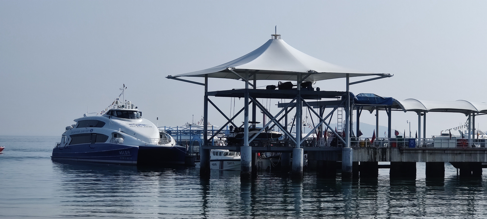

- 拍了张最好看的日出

(海棠湾到三亚的路程不远，两三个小时就可以搞完。三亚不用多介绍了，想玩可以多停留一两天，看自己的行程安排。)

- [亚龙湾](https://www.amap.com/place/B03830MRM2)
- [三亚湾椰梦长廊](https://www.amap.com/place/B03830MO6K)
- [大东海](https://www.amap.com/place/B03830NTNI)
...

### 中线

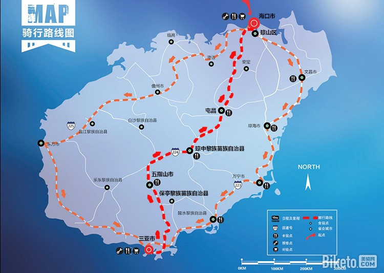

中线的以热带雨林、黎族风情为特色

#### Day1 三亚 -> 五指山

距离：80km

推荐景点：

- [海南槟榔谷黎苗文化旅游区](https://www.amap.com/place/B03210LJGX)
- [呀诺达雨林文化旅游区](https://www.amap.com/place/B03210LIMP)
- [五指山热带雨林风景区](https://www.amap.com/place/B0769000XI)

#### Day2 五指山 -> 屯昌

距离：130km

推荐景点：

- [海南省枫木鹿场](https://www.amap.com/place/B0764001J5)

#### Day3 屯昌 -> 海口

距离：90km

推荐景点：

- [海南热带野生动植物园](https://www.amap.com/place/B038202JGG)

### 西线

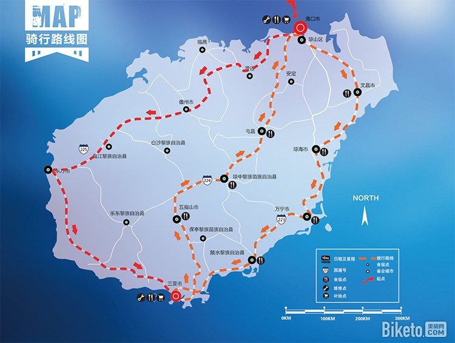

西线可能没有大规模的旅游开发活动，看起来会自然很多。

#### Day1 三亚 -> 东方

距离：160km

#### Day2 东方 -> 儋州

距离：120km

#### Day3 儋州 -> 海口

距离：130km

## 意外安排

台风，台风，台风！！！

十月份，仍有可能遇到台风天，这时候可能就需要其他解决方案了。

包括，来回时候，路上骑行期间。

(有想法的欢迎提mr)

## 参考

- [环海南岛骑行（东中线）指南](http://www.youxiake.com/gonglue/view?id=3532)
- [经典路线 | 环海南岛骑行攻略（东线篇）](http://www.biketo.com/tour/25193.html?all=1#page_3)
- [经典路线 | 环海南岛骑行攻略（中线篇）](http://www.biketo.com/tour/25158.html?all=1#page_3)
- [经典路线 | 环海南岛骑行攻略（西线篇）](http://www.biketo.com/tour/25245.html?all=1#page_3)
- [2017最美环海南岛骑行攻略（全海岸线+乡道飞登版）](https://bbs.qyer.com/thread-2636600-1.html)
- [2018单骑环海南岛](https://travel.qunar.com/youji/7000538)
- [【海南骑行攻略最新版】追寻心中的那片海](https://mp.weixin.qq.com/s/M7e2I8TZurjUJmCtw4WxkQ)
